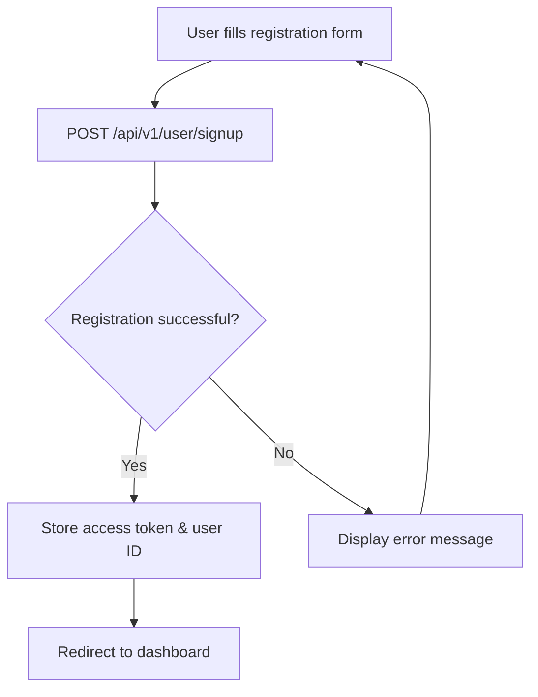
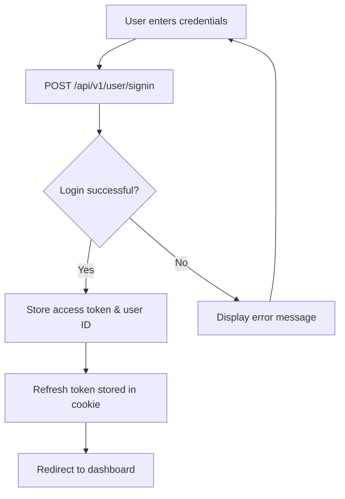
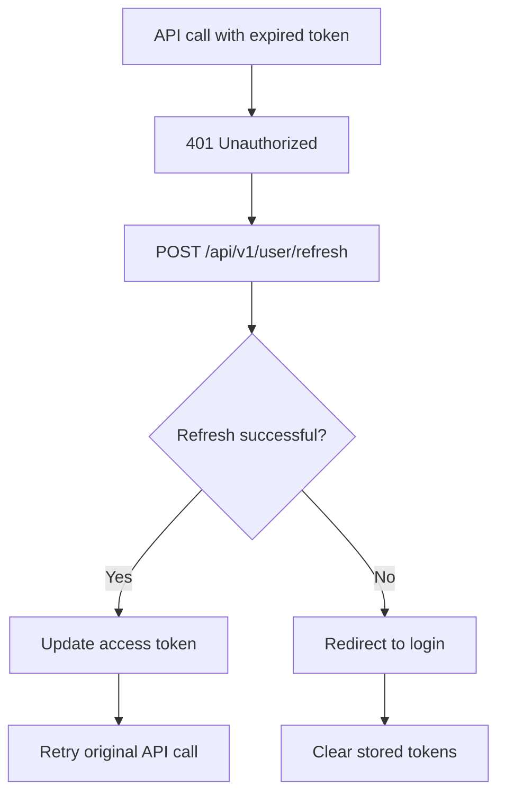

# Frontend Authentication Guide

This guide provides comprehensive instructions for implementing authentication in the frontend application based on the backend API implementation.

## Table of Contents
- [Overview](#overview)
- [API Endpoints](#api-endpoints)
- [Authentication Flow](#authentication-flow)
- [Implementation Guide](#implementation-guide)
- [Error Handling](#error-handling)
- [Security Considerations](#security-considerations)
- [Code Examples](#code-examples)

## Overview

The authentication system uses JWT (JSON Web Tokens) with the following features:
- **Access Token**: Short-lived (5 minutes) for API authentication
- **Refresh Token**: Long-lived (7 days) stored in HTTP-only cookies
- **Automatic Token Refresh**: Seamless token renewal
- **Secure Cookie Management**: HttpOnly cookies for refresh tokens

## API Endpoints

### Base URL
```
/api/v1/user
```

### Authentication Endpoints

| Endpoint | Method | Description | Authentication Required |
|----------|--------|-------------|----------------------|
| `/signin` | POST | User login | No |
| `/signup` | POST | User registration | No |
| `/refresh` | POST | Refresh access token | No (uses refresh token) |
| `/logout` | POST | User logout | Yes |
| `/change-password` | POST | Change user password | Yes |

## Authentication Flow

### 1. User Registration


### 2. User Login


### 3. Token Refresh


## Implementation Guide

### 1. Sign Up Implementation

#### Request Format
```typescript
interface SignUpRequest {
  username: string;  // Required, 3-50 characters
  password: string;  // Required, minimum 6 characters
}
```

#### API Call
```typescript
const signUp = async (credentials: SignUpRequest) => {
  const response = await fetch('/api/v1/user/signup', {
    method: 'POST',
    headers: {
      'Content-Type': 'application/json',
    },
    body: JSON.stringify(credentials),
  });

  const data = await response.json();
  
  if (response.ok) {
    // Store tokens
    localStorage.setItem('accessToken', data.data.accessToken);
    localStorage.setItem('userId', data.data.userId);
    return { success: true, data: data.data };
  } else {
    return { success: false, error: data.message };
  }
};
```

#### Response Format
```typescript
interface SignUpResponse {
  message: string;
  code: string;
  data: {
    accessToken: string;
    userId: string;
    refreshToken?: string;
  } | null;
}
```

### 2. Sign In Implementation

#### Request Format
```typescript
interface SignInRequest {
  username: string;  // Required, 3-50 characters
  password: string;  // Required, 6-100 characters
}
```

#### API Call
```typescript
const signIn = async (credentials: SignInRequest) => {
  const response = await fetch('/api/v1/user/signin', {
    method: 'POST',
    headers: {
      'Content-Type': 'application/json',
    },
    body: JSON.stringify(credentials),
    credentials: 'include', // Important for cookie handling
  });

  const data = await response.json();
  
  if (response.ok) {
    // Store tokens
    localStorage.setItem('accessToken', data.data.accessToken);
    localStorage.setItem('userId', data.data.userId);
    // Refresh token is automatically stored in cookie by backend
    return { success: true, data: data.data };
  } else {
    return { success: false, error: data.message };
  }
};
```

### 3. Token Refresh Implementation

#### API Call
```typescript
const refreshToken = async () => {
  const response = await fetch('/api/v1/user/refresh', {
    method: 'POST',
    headers: {
      'Content-Type': 'application/json',
    },
    credentials: 'include', // Important for cookie access
  });

  const data = await response.json();
  
  if (response.ok) {
    // Update stored access token
    localStorage.setItem('accessToken', data.data.accessToken);
    return { success: true, data: data.data };
  } else {
    // Refresh failed, redirect to login
    localStorage.removeItem('accessToken');
    localStorage.removeItem('userId');
    window.location.href = '/login';
    return { success: false, error: data.message };
  }
};
```

### 4. Logout Implementation

#### API Call
```typescript
const logout = async () => {
  const response = await fetch('/api/v1/user/logout', {
    method: 'POST',
    headers: {
      'Content-Type': 'application/json',
      'Authorization': `Bearer ${localStorage.getItem('accessToken')}`,
    },
    credentials: 'include', // Important for cookie clearing
  });

  // Clear local storage regardless of response
  localStorage.removeItem('accessToken');
  localStorage.removeItem('userId');
  
  // Redirect to login
  window.location.href = '/login';
};
```

### 5. Change Password Implementation

#### Request Format
```typescript
interface PasswordChangeRequest {
  currentPassword: string;  // Required
  newPassword: string;      // Required, minimum 8 characters
  confirmPassword: string;  // Required
}
```

#### API Call
```typescript
const changePassword = async (passwordData: PasswordChangeRequest) => {
  const response = await fetch('/api/v1/user/change-password', {
    method: 'POST',
    headers: {
      'Content-Type': 'application/json',
      'Authorization': `Bearer ${localStorage.getItem('accessToken')}`,
    },
    body: JSON.stringify(passwordData),
  });

  const data = await response.json();
  
  if (response.ok) {
    return { success: true, message: data.message };
  } else {
    return { success: false, error: data.message };
  }
};
```

## Error Handling

### Common Error Responses

| Status Code | Error Message | Description |
|-------------|---------------|-------------|
| 400 | Invalid credentials | Wrong username/password |
| 400 | Username already taken | Registration with existing username |
| 400 | Current password is incorrect | Wrong current password |
| 400 | New password and confirm password do not match | Password confirmation mismatch |
| 400 | New password must be different from current password | Same old and new password |
| 401 | Invalid or expired refresh token | Refresh token expired/invalid |
| 401 | Authentication required | Missing or invalid access token |
| 403 | Access denied | Insufficient privileges |
| 404 | User not found | User doesn't exist |

### Error Handling Implementation

```typescript
const handleApiError = (error: any, response: Response) => {
  switch (response.status) {
    case 400:
      return 'Invalid request. Please check your input.';
    case 401:
      // Try to refresh token
      return refreshToken().then(() => 'Token refreshed, please try again.');
    case 403:
      return 'Access denied. You do not have permission.';
    case 404:
      return 'Resource not found.';
    case 409:
      return 'Username already exists. Please choose another.';
    default:
      return 'An unexpected error occurred. Please try again.';
  }
};
```

## Security Considerations

### 1. Token Storage
- **Access Token**: Store in `localStorage` or `sessionStorage`
- **Refresh Token**: Automatically handled by backend via HTTP-only cookies
- **Never store sensitive data in plain text**

### 2. HTTPS Requirements
- Always use HTTPS in production
- The backend sets `Secure` flag on cookies in production

### 3. Token Expiration
- **Access Token**: 5 minutes (automatic refresh needed)
- **Refresh Token**: 7 days (stored in secure cookie)

### 4. Automatic Token Refresh
```typescript
// Axios interceptor example
axios.interceptors.response.use(
  (response) => response,
  async (error) => {
    if (error.response?.status === 401) {
      const refreshResult = await refreshToken();
      if (refreshResult.success) {
        // Retry original request
        return axios.request(error.config);
      }
    }
    return Promise.reject(error);
  }
);
```

## Code Examples

### Complete Authentication Service

```typescript
class AuthService {
  private baseUrl = '/api/v1/user';
  
  async signUp(credentials: SignUpRequest) {
    return this.makeRequest(`${this.baseUrl}/signup`, 'POST', credentials);
  }
  
  async signIn(credentials: SignInRequest) {
    return this.makeRequest(`${this.baseUrl}/signin`, 'POST', credentials, true);
  }
  
  async refreshToken() {
    return this.makeRequest(`${this.baseUrl}/refresh`, 'POST', {}, true);
  }
  
  async logout() {
    const token = localStorage.getItem('accessToken');
    await this.makeRequest(`${this.baseUrl}/logout`, 'POST', {}, true, token);
    this.clearAuthData();
  }
  
  async changePassword(passwordData: PasswordChangeRequest) {
    const token = localStorage.getItem('accessToken');
    return this.makeRequest(`${this.baseUrl}/change-password`, 'POST', passwordData, false, token);
  }
  
  private async makeRequest(
    url: string, 
    method: string, 
    data?: any, 
    includeCredentials = false,
    authToken?: string
  ) {
    const headers: Record<string, string> = {
      'Content-Type': 'application/json',
    };
    
    if (authToken) {
      headers['Authorization'] = `Bearer ${authToken}`;
    }
    
    const config: RequestInit = {
      method,
      headers,
    };
    
    if (data) {
      config.body = JSON.stringify(data);
    }
    
    if (includeCredentials) {
      config.credentials = 'include';
    }
    
    const response = await fetch(url, config);
    const result = await response.json();
    
    if (response.ok) {
      // Store tokens if present
      if (result.data?.accessToken) {
        localStorage.setItem('accessToken', result.data.accessToken);
      }
      if (result.data?.userId) {
        localStorage.setItem('userId', result.data.userId);
      }
    }
    
    return {
      success: response.ok,
      data: result.data,
      message: result.message,
      error: result.message
    };
  }
  
  private clearAuthData() {
    localStorage.removeItem('accessToken');
    localStorage.removeItem('userId');
  }
  
  isAuthenticated(): boolean {
    return !!localStorage.getItem('accessToken');
  }
  
  getAccessToken(): string | null {
    return localStorage.getItem('accessToken');
  }
  
  getUserId(): string | null {
    return localStorage.getItem('userId');
  }
}

export const authService = new AuthService();
```

### React Hook Example

```typescript
import { useState, useEffect } from 'react';
import { authService } from './AuthService';

export const useAuth = () => {
  const [user, setUser] = useState<{ id: string } | null>(null);
  const [loading, setLoading] = useState(true);

  useEffect(() => {
    const checkAuth = () => {
      if (authService.isAuthenticated()) {
        setUser({ id: authService.getUserId()! });
      }
      setLoading(false);
    };
    
    checkAuth();
  }, []);

  const signIn = async (credentials: SignInRequest) => {
    const result = await authService.signIn(credentials);
    if (result.success) {
      setUser({ id: result.data.userId });
    }
    return result;
  };

  const signUp = async (credentials: SignUpRequest) => {
    const result = await authService.signUp(credentials);
    if (result.success) {
      setUser({ id: result.data.userId });
    }
    return result;
  };

  const logout = async () => {
    await authService.logout();
    setUser(null);
  };

  return {
    user,
    loading,
    signIn,
    signUp,
    logout,
    isAuthenticated: authService.isAuthenticated()
  };
};
```

## Testing

### Manual Testing Checklist

- [ ] User can register with valid credentials
- [ ] User cannot register with existing username
- [ ] User can sign in with valid credentials
- [ ] User cannot sign in with invalid credentials
- [ ] Access token is stored after successful login
- [ ] Refresh token cookie is set after successful login
- [ ] User can change password when authenticated
- [ ] User cannot change password without authentication
- [ ] Token refresh works when access token expires
- [ ] Logout clears all stored data and cookies
- [ ] User is redirected to login when refresh token expires

### API Testing with cURL

```bash
# Sign Up
curl -X POST http://localhost:8081/api/v1/user/signup \
  -H "Content-Type: application/json" \
  -d '{"username": "testuser", "password": "password123"}'

# Sign In
curl -X POST http://localhost:8081/api/v1/user/signin \
  -H "Content-Type: application/json" \
  -d '{"username": "testuser", "password": "password123"}' \
  -c cookies.txt

# Change Password (replace TOKEN with actual access token)
curl -X POST http://localhost:8081/api/v1/user/change-password \
  -H "Content-Type: application/json" \
  -H "Authorization: Bearer TOKEN" \
  -d '{"currentPassword": "password123", "newPassword": "newpassword123", "confirmPassword": "newpassword123"}'

# Refresh Token
curl -X POST http://localhost:8081/api/v1/user/refresh \
  -H "Content-Type: application/json" \
  -b cookies.txt

# Logout
curl -X POST http://localhost:8081/api/v1/user/logout \
  -H "Content-Type: application/json" \
  -H "Authorization: Bearer TOKEN" \
  -b cookies.txt
```

## Conclusion

This guide provides a complete implementation for frontend authentication using the backend API. The system is designed to be secure, user-friendly, and maintainable. Remember to always handle errors gracefully and provide clear feedback to users throughout the authentication process.
