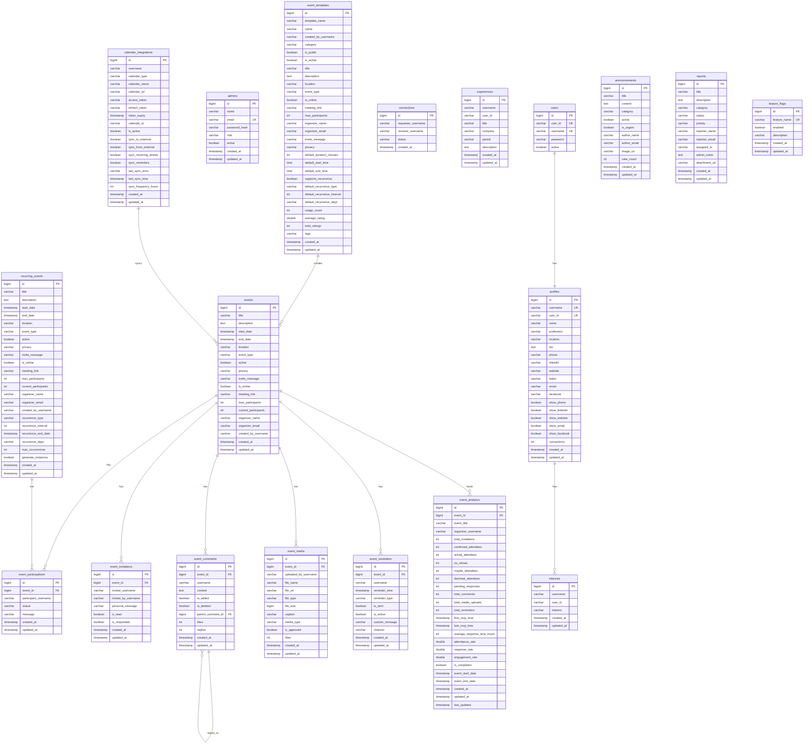
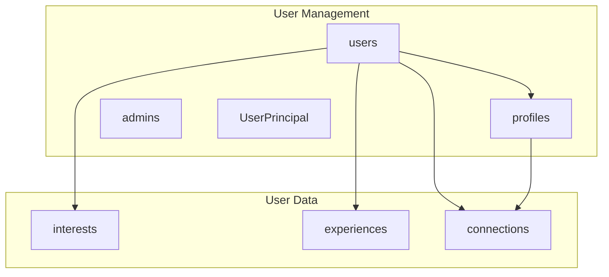
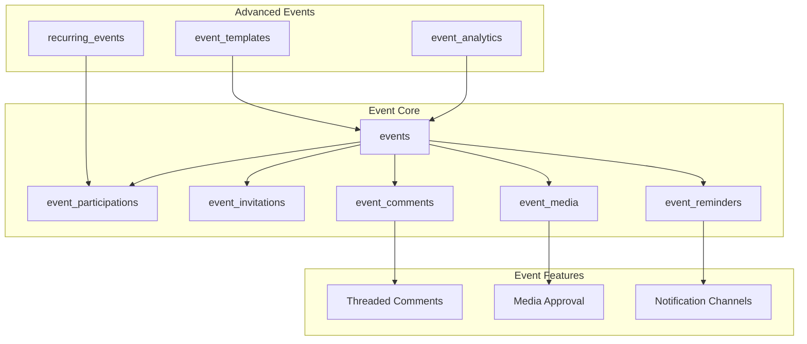
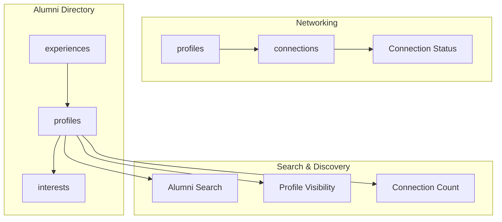
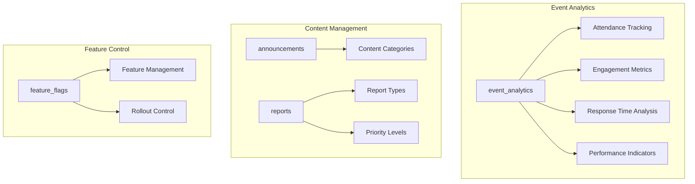
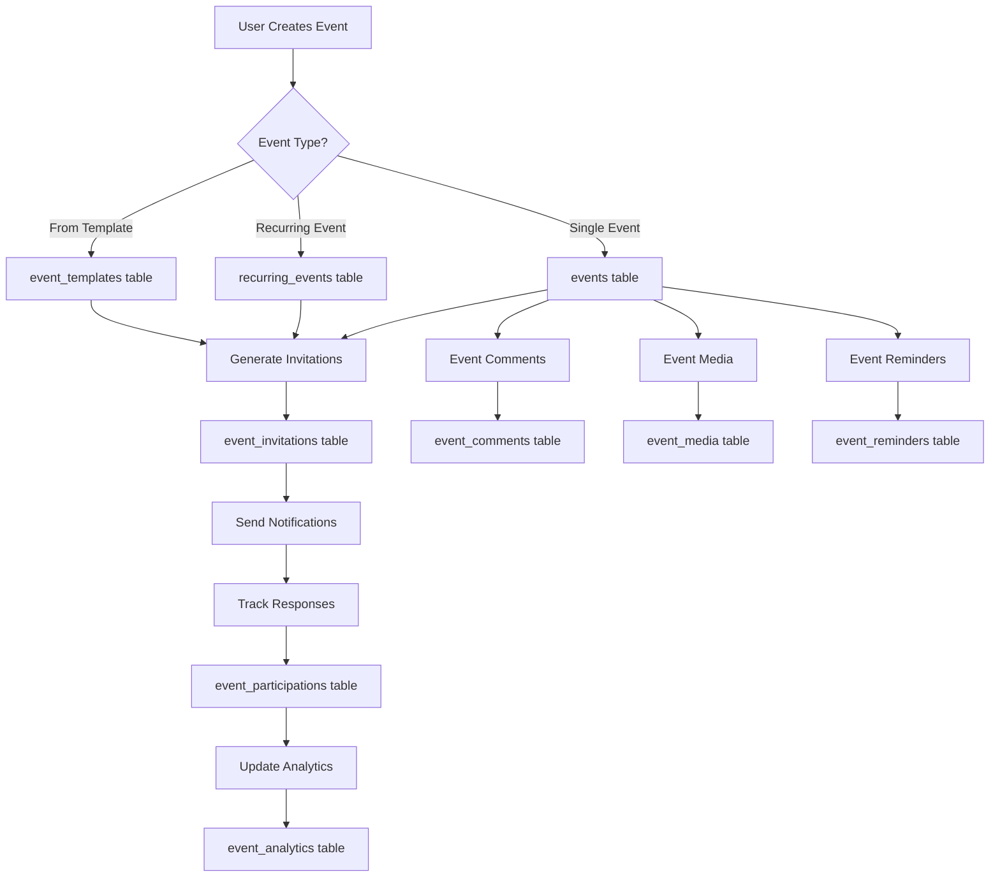
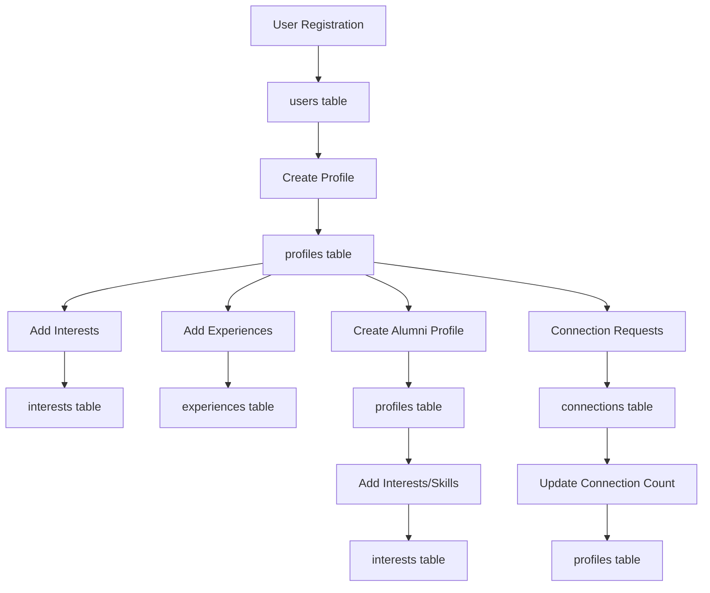
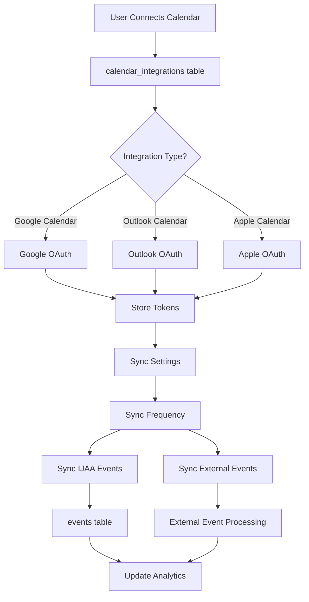
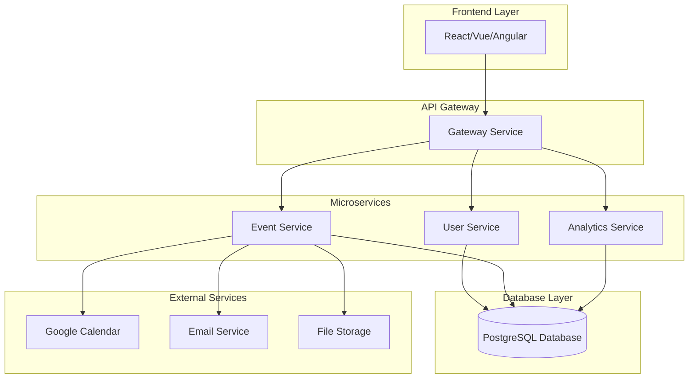

# 🗄️ IJAA Database Design - Visual Diagrams

## 📊 Complete Database Entity Relationship Diagram

## 🎯 Core Module Relationships

### 1. **User Management Module**

### 2. **Event Management Module**

### 3. **Networking & Alumni Directory**

### 4. **Analytics & Reporting**

## 🔄 Data Flow Diagrams

### 1. **Event Creation & Management Flow**

### 2. **User Registration & Profile Flow**

### 3. **Calendar Integration Flow**

## 📈 Database Schema Summary

### **Core Tables (15)**
1. `users` - Basic user authentication
2. `admins` - Administrative users
3. `profiles` - User profile information (includes alumni data)
4. `events` - Event management
5. `event_participations` - Event attendance
6. `event_invitations` - Event invitations
7. `event_comments` - Event discussions
8. `event_media` - Event media files
9. `event_reminders` - Event notifications
10. `recurring_events` - Recurring event patterns
11. `event_templates` - Event templates
12. `event_analytics` - Event performance metrics
13. `connections` - User networking
14. `interests` - User interests and skills
15. `experiences` - User work experience

### **Supporting Tables (4)**
16. `calendar_integrations` - External calendar sync
17. `announcements` - System announcements
18. `reports` - User reports and feedback
19. `feature_flags` - Feature control system

### **Key Features**
- **19 Total Tables** with comprehensive relationships
- **Audit Trail** with created_at/updated_at timestamps
- **Soft Deletes** for data preservation
- **Privacy Controls** for events and profiles
- **Analytics Tracking** for performance monitoring
- **Feature Flags** for dynamic feature control
- **Calendar Integration** for external sync
- **Moderation System** for content management

## 🎨 Visual Database Architecture

## 🔄 **Database Optimization Summary**

### **Removed Redundant Tables:**
- ❌ `alumni_profiles` - Redundant with existing `profiles` table
- ❌ `alumni_skills` - Redundant with existing `interests` table

### **Benefits of Optimization:**
- ✅ **Reduced Complexity** - From 21 to 19 tables
- ✅ **Eliminated Data Duplication** - Single source of truth for user profiles
- ✅ **Simplified Maintenance** - Fewer tables to manage and maintain
- ✅ **Better Performance** - Reduced joins and data redundancy
- ✅ **Consistent Data Model** - Unified approach to user data

### **Alumni Functionality Now Uses:**
- **`profiles`** table for all alumni profile information
- **`interests`** table for skills, interests, and expertise
- **`experiences`** table for work history and achievements
- **`connections`** table for networking relationships

### **Search & Discovery Features:**
The existing `AlumniSearchService` implementation already correctly uses the `profiles` and `interests` tables for alumni search functionality, making the separate `AlumniSearch` entity unnecessary.

---

This comprehensive diagram view provides a clear understanding of the optimized IJAA database structure, relationships, and data flow patterns. The visual representations make it easy to grasp the complex relationships between different entities and understand how data flows through the system.
