# 🏗️ Microservices Architecture Migration

## 📊 **Current Architecture (Monolithic User Service)**

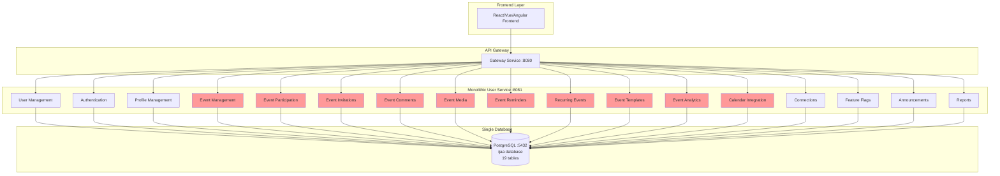

## 🚀 **Proposed Architecture (Microservices)**

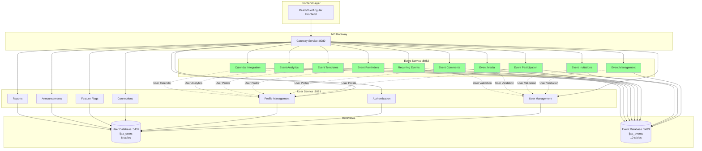

## 📈 **Comparison Analysis**

### **Current Architecture (Monolithic)**
| Aspect | Current State |
|--------|---------------|
| **Service Count** | 1 large service |
| **Database** | Single database (19 tables) |
| **Deployment** | All-or-nothing deployment |
| **Scaling** | Scale entire application |
| **Development** | Single team, single codebase |
| **Testing** | End-to-end testing required |
| **Performance** | Shared resources, potential bottlenecks |

### **Proposed Architecture (Microservices)**
| Aspect | Proposed State |
|--------|----------------|
| **Service Count** | 2 focused services |
| **Database** | 2 specialized databases |
| **Deployment** | Independent deployments |
| **Scaling** | Scale services independently |
| **Development** | Separate teams, focused codebases |
| **Testing** | Service-level testing |
| **Performance** | Optimized resources per domain |

## 🔄 **Migration Benefits**

### **1. Scalability Improvements**
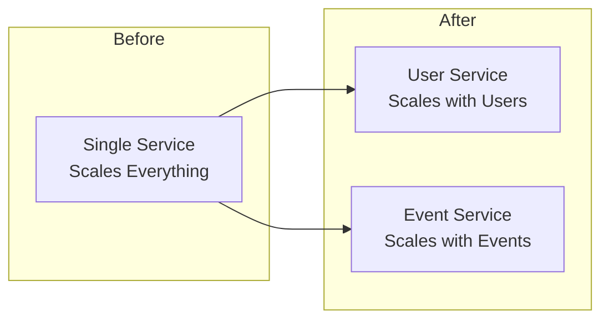

### **2. Database Performance**
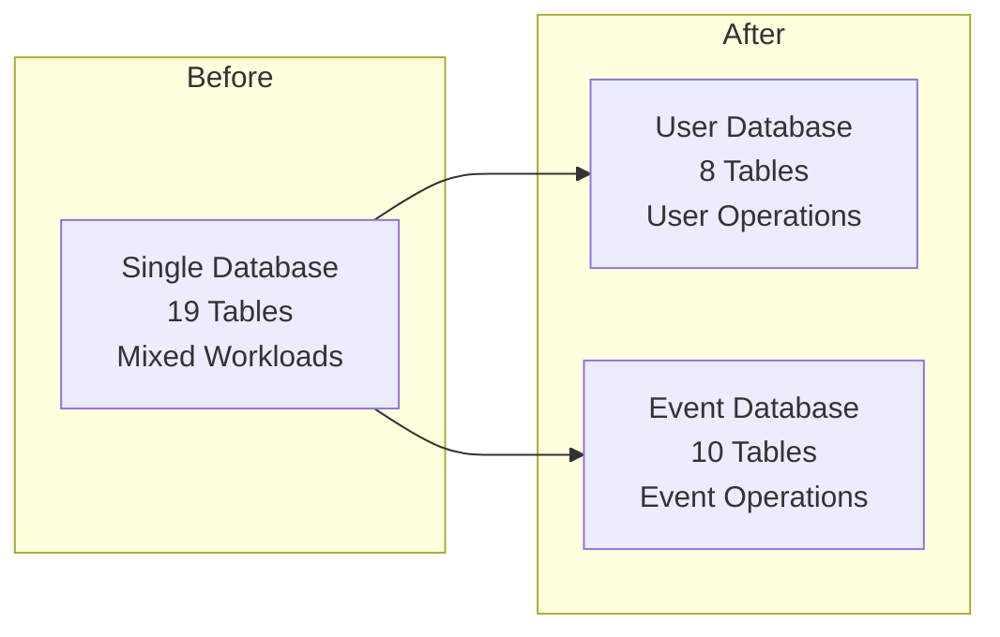

### **3. Development Velocity**
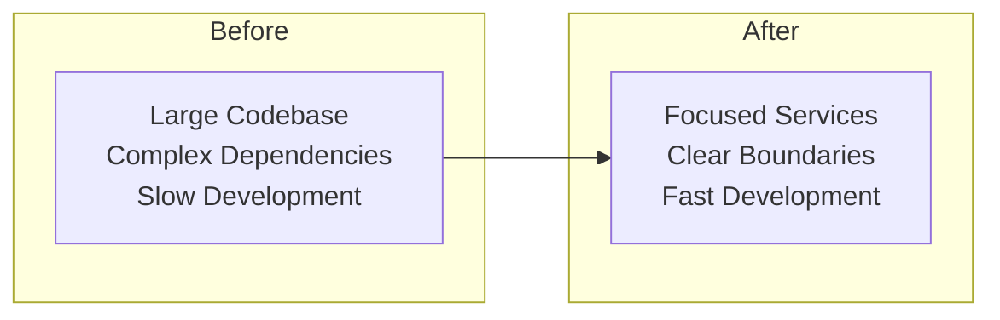

## 🎯 **Service Responsibilities**

### **User Service (:8081)**
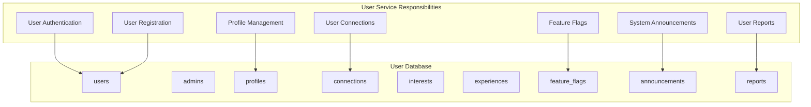

### **Event Service (:8082)**
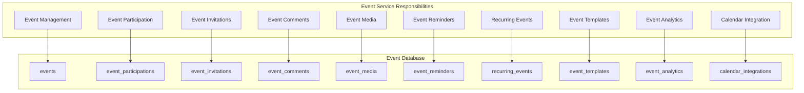

## 🔗 **Service Communication Patterns**

### **Synchronous Communication**
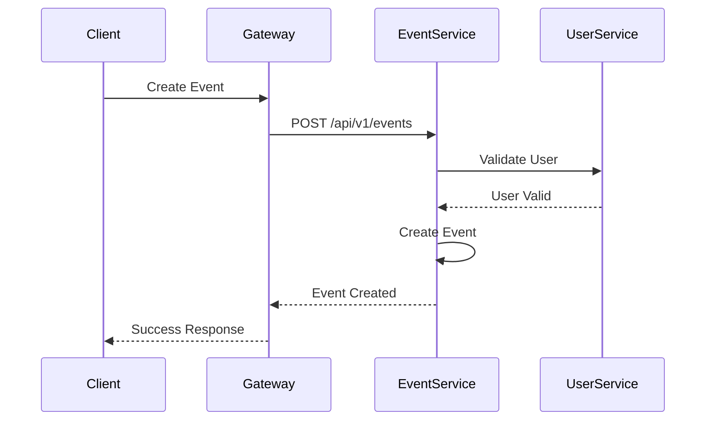

### **Asynchronous Communication**
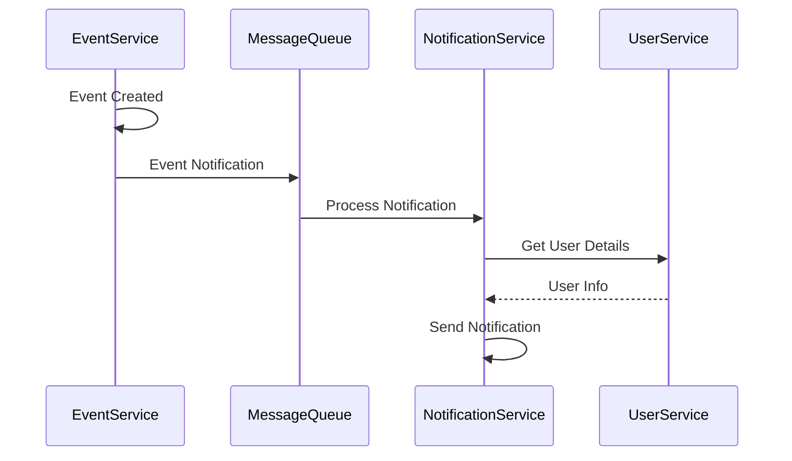

## 📊 **Performance Metrics**

### **Expected Performance Improvements**
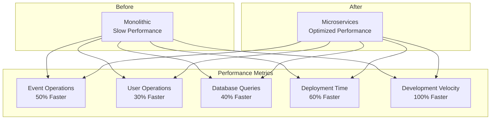

## 🚀 **Migration Timeline**

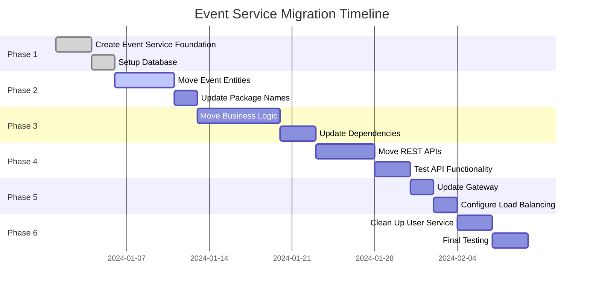

---

This migration will transform the IJAA platform from a monolithic architecture to a modern, scalable microservices architecture, enabling better performance, maintainability, and development velocity.
